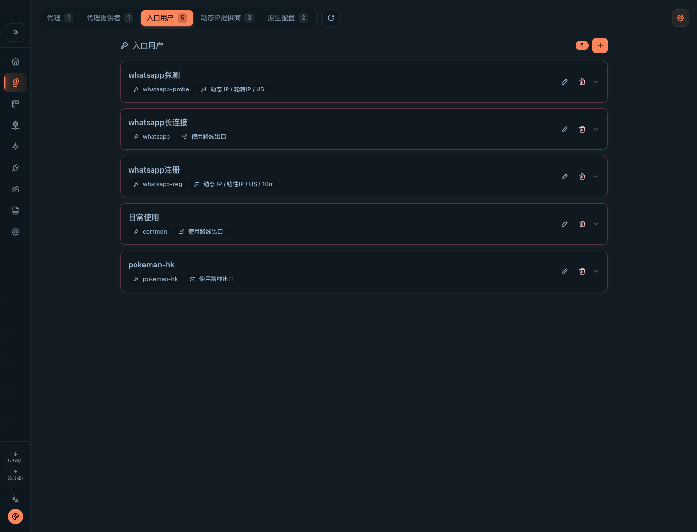
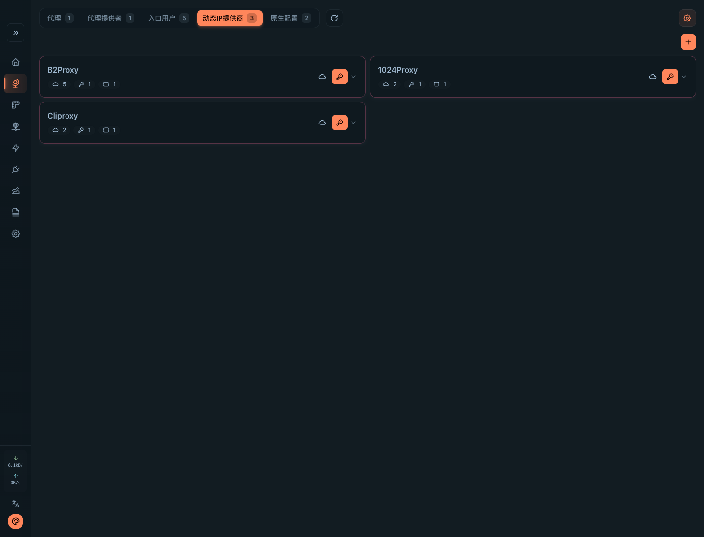
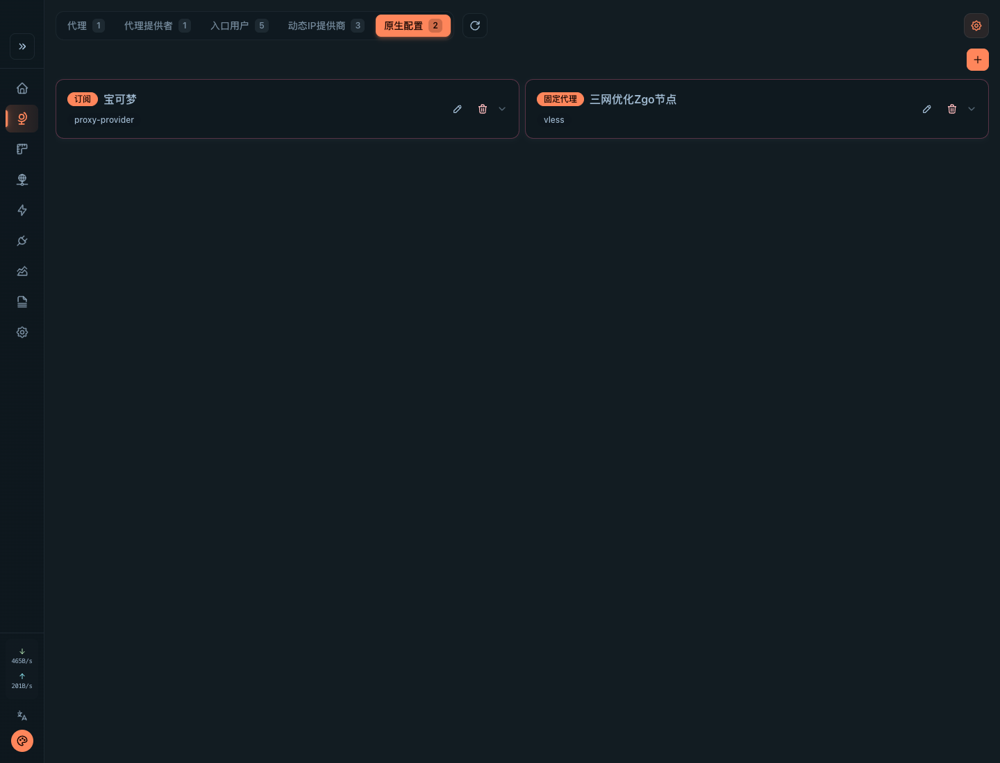
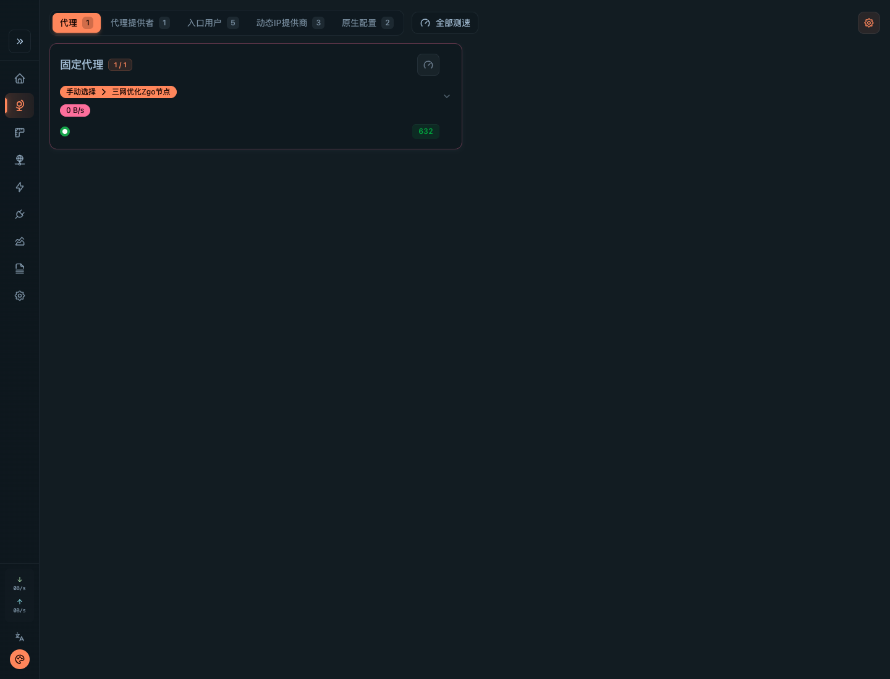
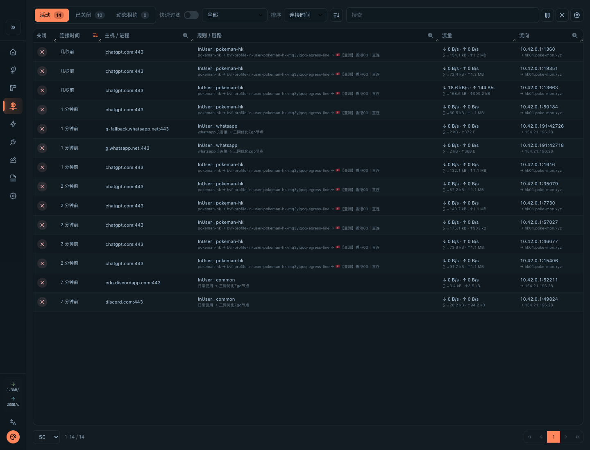

# proxy-runtime

`proxy-runtime` is a standalone unified egress proxy gateway. It gives applications one stable proxy entry while keeping proxy-provider accounts, dynamic-IP leases, egress routing, and Mihomo data-plane configuration inside this service.

Mihomo is the only data plane. `proxy-runtime` owns the control plane, provider adapters, lease orchestration, generated Mihomo configuration, HTTP API, and dashboard overlay.

## Screenshots

### Entry users

Proxy usernames are managed as product-facing entry users. Each user selects either direct egress or an egress profile without exposing provider session material to callers.



### Dynamic IP providers

Provider endpoints, provider accounts, and pool capacity are configured from the dashboard and reconciled into runtime lease choices.



### Mihomo-native config

Native Mihomo proxies and proxy-providers stay editable for operators who need direct control over static nodes and provider subscriptions.



### Proxy groups

The standard Mihomo proxy view remains available for operational selection, health, and traffic observations.



### Runtime connections

Mihomo connection telemetry keeps the selected entry user and egress route visible during live traffic debugging.



## Responsibilities

- Run and reconcile Mihomo configuration for the fixed entry listener, proxy users, dynamic-IP leases, and egress profiles.
- Manage proxy-provider adapters, dynamic provider endpoints, provider accounts, provider pools, and sticky lease state.
- Present a dynamic-proxy-provider style product surface: callers use one entry address plus proxy username/password to select an egress policy.
- Keep provider control-plane access separate from business data-plane egress.
- Provide runtime observations for dynamic IP leases, exit IP checks, IP fraud checks, edge canary checks, and target connectivity checks.

`proxy-runtime` does not implement a proxy kernel. Mihomo performs traffic forwarding, authentication, routing, proxy groups, proxy providers, and health checks.

## Runtime model

- `ProxyUserRoute`: a registered proxy username that maps inbound traffic to direct egress or an egress profile.
- Fixed entry listener: the Mihomo mixed listener exposed to applications.
- `EgressProfileSettings`: route composition with a line layer and an exit layer.
- `ProxyDynamicIPProviderSettings`: dynamic provider endpoint and provider-account settings owned by `proxy-runtime`.
- `ProxyDynamicLease`: a dynamic IP lease managed by the control plane.
- `ProxyDynamicIPSelectionPlan`: the selected provider account and endpoint for a dynamic lease.

Traffic shape:

```text
Application
  -> fixed entry host:port
  -> proxy username/password
  -> Mihomo IN-USER rule
  -> egress profile
  -> line layer
  -> route exit, static IP, or dynamic IP exit
```

Chained egress is configuration-only: `proxy-runtime` stores egress profiles as `route + exit` and renders them into Mihomo-native proxy groups, provider overrides, and `dialer-proxy`. `exit=direct` means using the selected route's own exit; it does not create a hidden second hop. There is no GOST runtime and no separate chain proxy kernel.

Detailed design: `docs/egress-gateway-design.md`.

## Configuration

Runtime environment variables are intentionally small. Proxy users, dynamic IP providers, provider credentials, IP fraud settings, canary settings, and Mihomo-native static config are control-plane data managed through API/UI according to the proto contract.

Required bootstrap:

- `PROXY_RUNTIME_ENCRYPTION_KEY`: encryption key for stored provider credentials and settings values.

Storage and runtime coordination:

- `PROXY_RUNTIME_POSTGRES_DSN` or `PG_DSN`: optional PostgreSQL DSN. When omitted, `proxy-runtime` uses its embedded SQLite control store.
- `PROXY_RUNTIME_DATA_DIR`: local data directory for embedded SQLite and runtime files when PostgreSQL is omitted. Default `/var/lib/proxy-runtime`.
- `PROXY_RUNTIME_REDIS_URL`: Redis URL for distributed lease locks and provider-account concurrency slots. It is required when PostgreSQL is configured and optional for SQLite single-replica runtime.

Optional bootstrap with defaults:

- `PROXY_RUNTIME_ADDR`: HTTP control-plane address. Default `:8080`.
- `PROXY_RUNTIME_MIHOMO_PATH`: Mihomo executable path. Default `mihomo`.
- `PROXY_RUNTIME_MIHOMO_CONFIG_DIR`: generated Mihomo config directory. Default `/var/lib/proxy-runtime/mihomo`.
- `PROXY_RUNTIME_MIHOMO_API_ADDR`: Mihomo external-controller address. Default `127.0.0.1:18901`.
- `PROXY_RUNTIME_MIHOMO_DASHBOARD_DIR`: built dashboard asset directory. Default `/app/dashboard/metacubexd`.
- `PROXY_RUNTIME_MIHOMO_DASHBOARD_URL`: optional external dashboard asset URL.
- `PROXY_RUNTIME_MIHOMO_HEALTH_CHECK_URL`: URL used by Mihomo health checks. Default `https://www.gstatic.com/generate_204`.
- `PROXY_RUNTIME_MIHOMO_HEALTH_CHECK_INTERVAL_SECONDS`: generated health-check interval. Default `300`.
- `PROXY_RUNTIME_MIHOMO_HEALTH_CHECK_TIMEOUT_SECONDS`: generated health-check timeout. Default `5`.
- `PROXY_RUNTIME_LOCAL_ADDR`: fixed entry listener address. Default `:1080`.
- `PROXY_RUNTIME_LOCAL_PROTOCOL`: fixed entry protocol, `http` or `socks5`. Default `http`.
- `PROXY_RUNTIME_SESSION_ADVERTISED_HOST`: optional host returned when the entry binds to loopback or all interfaces.

Optional local bootstrap:

- `PROXY_RUNTIME_LOCAL_PASSWORD`: password used only by the explicit lease API for temporary proxy users. Applications should prefer fixed gateway IN-USER rules.
- `PROXY_RUNTIME_PROXY_USERS_JSON`: initial registered proxy users for fixed entry routing. Only `direct` and `profile` routes are accepted; prefer API/UI after boot.

Example proxy users:

```sh
PROXY_RUNTIME_PROXY_USERS_JSON='[
  {"id":"crawler-profile","username":"crawler-profile","password":"crawler-pass","route":"profile","profile_id":"profile-us"},
  {"id":"direct","username":"direct","password":"direct-pass","route":"direct"}
]'
```

Provider bootstrap is optional and kept for local bring-up. Dynamic provider accounts and endpoints should be stored through API/UI:

- `PROXY_RUNTIME_PROVIDER`: base provider, `1024proxy` or `none`. Default `1024proxy`.
- `PROXY_RUNTIME_PROVIDER_HTTP_PROXY`: optional HTTP proxy used only for provider control-plane calls.
- `PROXY_RUNTIME_REQUEST_TIMEOUT_SECONDS`: provider HTTP timeout. Default `10`.
- `PROXY_RUNTIME_REFRESH_SECONDS`: reconcile interval. Default `300`.

1024Proxy username/session mode:

- `PROXY_RUNTIME_1024_USERNAME` / `PROXY_RUNTIME_1024_PASSWORD`: provider credentials.
- `PROXY_RUNTIME_1024_PROTOCOL`: upstream protocol, `http` or `socks5`. Default `http`.

1024Proxy API extraction mode:

- `PROXY_RUNTIME_1024_API_URL`: API URL copied from the provider console.
- `PROXY_RUNTIME_1024_API_REGION` / `PROXY_RUNTIME_1024_API_FORMAT` / `PROXY_RUNTIME_1024_API_TIME` / `PROXY_RUNTIME_1024_API_NUM` / `PROXY_RUNTIME_1024_API_TYPE`: API query overrides.

IP fraud providers, IP geo providers, Cloudflare canary, dynamic provider endpoints, proxy users, egress profiles, and proxy exit IP check settings are managed through `GET/PUT /api/settings` and focused `/api/settings/*` endpoints.

## Standalone image

The repository Dockerfile is self-contained. It builds the Go runtime, packages Mihomo, builds the project-owned MetaCubeXD fork, and serves the dashboard from the same HTTP process.

```sh
docker build -t proxy-runtime:local .

docker run --rm \
  -p 8080:8080 \
  -p 1080:1080 \
  -v proxy-runtime-data:/var/lib/proxy-runtime \
  -e PROXY_RUNTIME_ENCRYPTION_KEY=change-me-at-least-32-characters \
  proxy-runtime:local
```

For multi-replica runtime, configure PostgreSQL plus Redis so lease locks, provider-account concurrency slots, and service-owned state are coordinated outside a single process.

## HTTP API

The HTTP surface uses root UI, `/api/*` control-plane routes, and `/mihomo/*` Mihomo reverse-proxy routes.

- `GET /`: MetaCubeXD fork frontend entry.
- `GET /healthz`: process liveness.
- `GET /readyz`: Mihomo data-plane readiness.
- `GET /api/providers`: provider capability descriptors.
- `GET /api/provider-accounts`, `POST /api/provider-accounts`, `PUT /api/provider-accounts`, `DELETE /api/provider-accounts`: upstream provider accounts.
- `GET /api/leases`: dynamic IP leases.
- `POST /api/leases/acquire`: explicit lease tooling endpoint.
- `POST /api/leases/release`: release an explicit lease idempotently.
- `POST /api/proxy_exit_ip`: check the exit IP through a configured listener.
- `POST /api/proxy_exit_geo`: lookup geo for an IP without proxy egress.
- `POST /api/ip_fraud_check`: check IP fraud risk.
- `POST /api/check_cf_access_risk`: check edge access risk through the selected egress.
- `POST /api/target_connectivity_check`: check target connectivity through the selected egress.
- `GET /api/proxy_exit_check_snapshot`, `POST /api/proxy_exit_check_snapshot`: read or refresh proxy exit check snapshots.
- `GET /api/settings`, `POST /api/settings`, `PUT /api/settings`: runtime settings.
- `GET /api/settings/in-user-rules`, `POST /api/settings/in-user-rules`, `PUT /api/settings/in-user-rules`: proxy username/password rules with line and exit settings.
- `GET /api/settings/dynamic-ip-providers`, `POST /api/settings/dynamic-ip-providers`, `PUT /api/settings/dynamic-ip-providers`: dynamic provider endpoints, accounts, and pool settings.
- `GET /api/settings/mihomo-native`, `POST /api/settings/mihomo-native`, `PUT /api/settings/mihomo-native`: Mihomo-native static proxies, providers, groups, and rules.
- `GET /api/settings/ip-fraud-providers`: supported IP fraud providers.
- `GET /api/settings/ip-geo-providers`: supported IP geo providers.
- `GET /mihomo/dashboard`: MetaCubeXD controller bootstrap.
- `/mihomo/ui/*`: same-origin reverse proxy to Mihomo `external-ui`.
- `/mihomo/controller/*`: same-origin reverse proxy to Mihomo external-controller for MetaCubeXD.

## Dashboard

The dashboard uses a project-owned MetaCubeXD fork as the main frontend:

- Upstream MetaCubeXD pages remain the Mihomo operations surface: overview, proxies, proxy providers, rules, connections, logs, config, fixed proxies, subscriptions, and provider updates.
- The overlay adds `入口用户` and `动态IP提供商` inside MetaCubeXD `proxies` for proxy username/password routing plus dynamic provider endpoints/accounts.
- The overlay adds `原生配置` inside MetaCubeXD `proxies` for Mihomo-native static proxies and proxy-providers managed by the runtime settings API.
- The overlay adds `动态租约` inside MetaCubeXD `connections` for active dynamic lease runtime state.

The forked MetaCubeXD assets are built into the `proxy-runtime` image and served full-page through same-origin routes. Browsers do not need direct access to the loopback-only Mihomo API.

## Generation

Proto contracts and generated Go/TypeScript types are owned by this repository:

- Source: `proto/byte/v/forge/contracts/proxyruntime/v1/proxy_runtime.proto`
- Go generated package: `gen/go/byte/v/forge/contracts/proxyruntime/v1`
- TypeScript generated package: `metacubexd-fork/types/byte/v/forge/contracts/proxyruntime/v1`

Do not edit generated files manually. Run `sh scripts/generate-proto.sh` after proto changes; run `sh scripts/generate-web-proto.sh` when the frontend type output must be regenerated.

## Verification

Preferred source-level checks:

```sh
gofmt -w ./cmd ./internal
git diff --check
```

When proto contracts change, regenerate derived code with:

```sh
sh scripts/generate-proto.sh
sh scripts/generate-web-proto.sh
```
